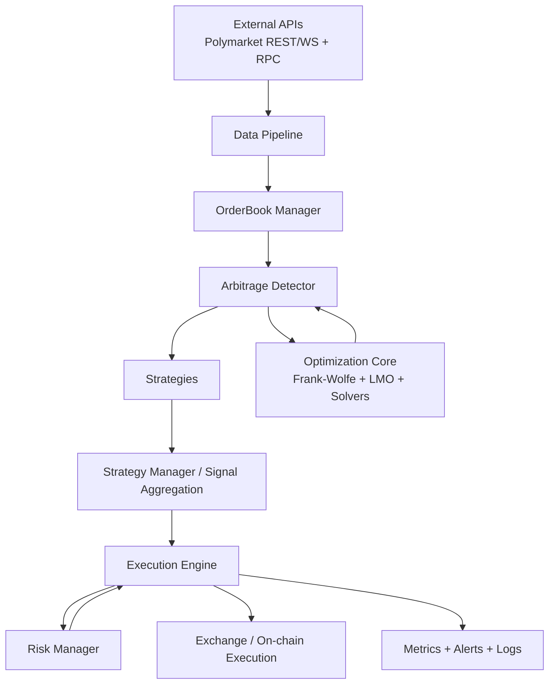
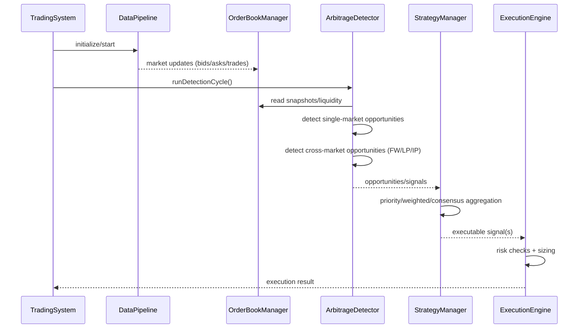
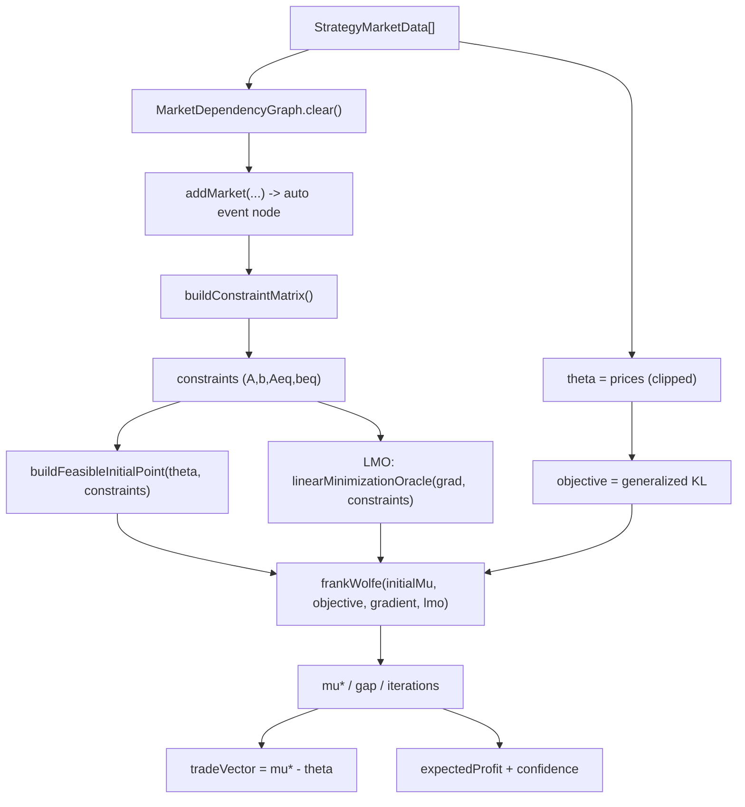
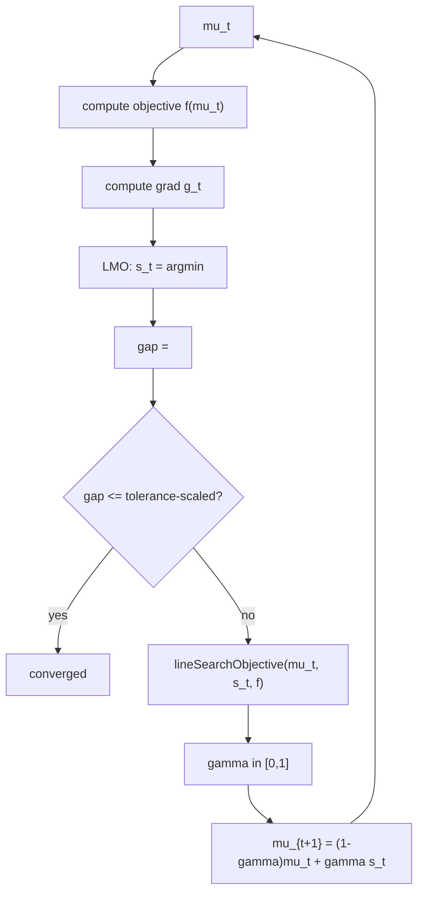
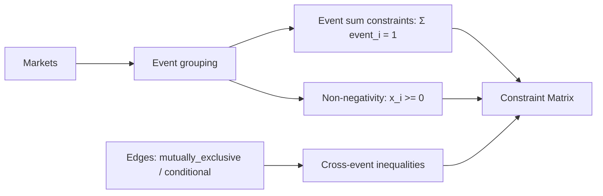
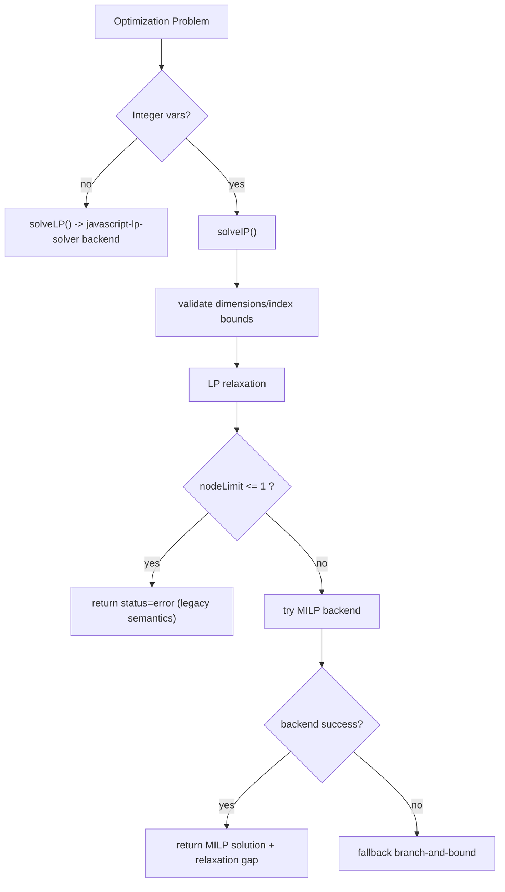
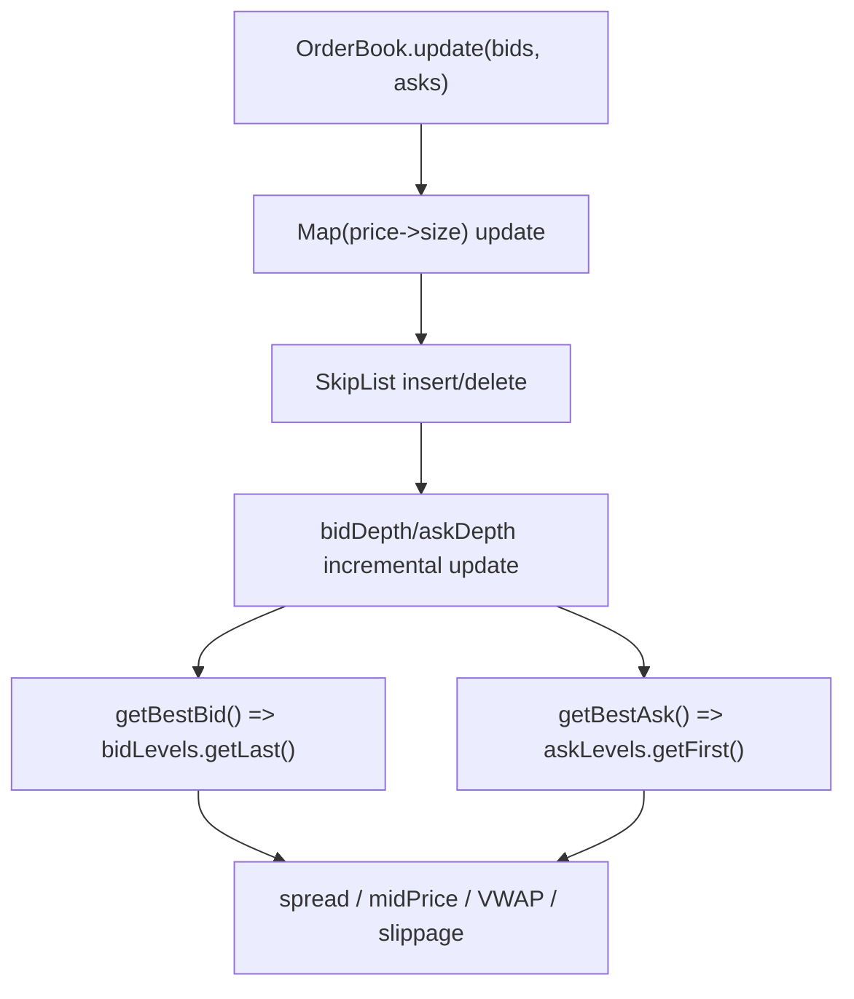
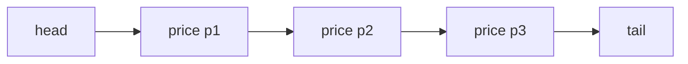
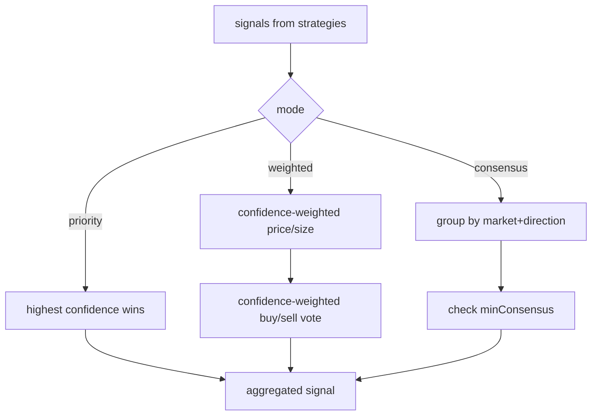
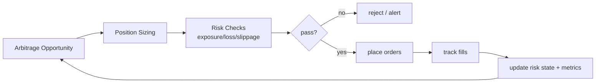

# Polymarket 项目 Mermaid 学习文档

这份文档用 Mermaid 图把项目核心链路串起来，目标是帮助你快速建立“模块职责 + 数据流 + 算法流”的整体心智模型。

---

## 1. 全局架构（先看这张）

你要抓住 3 条主线：
- 市场数据主线：`API -> Data Pipeline -> OrderBook -> Arbitrage Detector`
- 决策主线：`Detector -> Strategy -> Aggregation -> Execution`
- 约束优化主线：`Detector <-> Optimization Core`

---

## 2. 启动到单次检测循环

重点理解：
- 检测和执行是分离的，执行前一定走风控。
- 跨市场检测不是规则硬编码，而是“约束 + 优化”。

---

## 3. 跨市场套利（核心算法链）

对应代码：
- 约束图构建：`src/market/dependency-graph.ts`
- 策略主流程：`src/strategies/cross-market-arbitrage.ts`
- 数学目标：`src/utils/math.ts`

---

## 4. Frank-Wolfe 迭代细节

你会看到两个关键改进：
- `line-search` 现在走真实目标函数，不是局部近似。
- 迭代不再做错误的全局 simplex 投影，避免破坏独立等式组可行性。

代码：`src/core/frank-wolfe.ts`、`src/core/line-search.ts`

---

## 5. Dependency Graph 到约束矩阵

学习点：
- `addMarket()` 会自动创建/更新 event 节点，因此“只传 market”也能得到事件等式约束。
- `buildConstraintMatrix()` 内部使用 `marketId -> index` 映射，提高大规模市场构建速度。

---

## 6. 求解器选择逻辑（LP/IP）

学习顺序建议：
1. 先看 LP：`src/optimization/lp-solver.ts`
2. 再看 IP：`src/optimization/ip-solver.ts`

---

## 7. OrderBook + SkipList 结构

数据结构关系：

为什么快：
- 最优 bid/ask 是 O(1) 读取（头尾指针）。
- 插入/删除/查找是 O(log n)。
- 深度是增量维护，不需要每次全量重算。

---

## 8. 信号聚合决策图

代码：`src/strategies/signal-aggregation.ts`

---

## 9. 检测与执行风控闭环

学习时建议同时打开：
- 执行：`src/execution/execution-engine.ts`
- 风控：`src/execution/risk-manager.ts`

---

## 10. 推荐学习路径（按图走）

1. 先看第 1、2 张图，建立全局流程。
2. 再看第 3、4、5 张图，理解“约束怎么变成可优化问题”。
3. 接着看第 6、7 张图，理解求解器与订单簿性能。
4. 最后看第 8、9 张图，理解从信号到执行的业务闭环。

如果你按这个顺序看代码，进入速度会比“按目录硬读”快很多。
